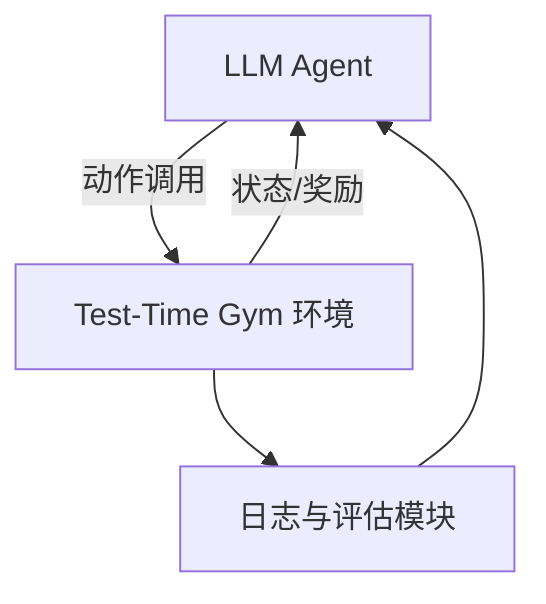

# Test-Time Gym 环境

> 一个用于 **LLM 智能体测试时学习** 的安全仿真环境，支持多步骤任务（如机票预订）的探索、经验积累与程序化知识抽取。

---

## 🌟 特点

- **安全可控**：不涉及真实资金或外部 API，所有交互均在模拟环境中完成。
- **程序性知识获取**：支持智能体通过经验挖掘形成可重用的 **技能（skills/macro-actions）**。
- **在线适应**：内置探索/利用机制（explore vs exploit），让智能体能在测试时自我改进。
- **可复现**：支持随机种子与轨迹回放，保证实验一致性。
- **多维评估指标**：任务成功率、约束违规率、平均步长、后悔值（Regret）等。

---

## 🏗 系统架构



**模块说明：**

- **LLM Agent**：策略选择、技能调用、经验更新
- **Gym 环境**：状态生成、动作执行、奖励计算、随机扰动
- **日志/评估**：任务成功率、步长、探索/利用比例等

---

## 🎮 环境设计

### 状态（Observation）

```json
{
  "view": "search_results | cart | payment | receipt | error",
  "forms": {"from": "SFO", "to": "MAD", "date": "2025-10-15"},
  "flights": [
    {"id": "IB6123", "price": 870, "depart": "10:40", "arrive": "07:15+1", "stops": 1, "airline": "IB"}
  ],
  "cart": {"items": [{"flight_id": "IB6123", "price": 870}], "total": 870},
  "payment_state": {"needs_3ds": true, "attempts": 0},
  "constraints": {"budget": 900, "depart_after": "10:00", "max_stops": 1},
  "messages": ["Tip: Prices drop if you shift ±1 day"]
}
```

### 动作（Action）

- `search_flights(from, to, date)`
- `filter_results({depart_after, max_stops, airline})`
- `select_flight(flight_id)`
- `add_to_cart(flight_id)`
- `proceed_to_payment()`
- `enter_card(card_token)`
- `confirm_payment()`
- `apply_coupon(code)`
- `restart()` / `abort()`

### 奖励机制（Reward）

| 奖励类型        | 描述                          | 分值范围 |
|-----------------|-------------------------------|----------|
| 终局奖励        | 成功出票且满足约束            | +1.0     |
| 约束违规        | 超预算、时间不符等            | -0.3     |
| 过程奖励        | 购物车非空、进入支付页等      | +0.02~0.05 |
| 惩罚            | 无效动作、支付失败            | -0.05    |
| 时间成本        | 每步消耗                      | -0.01    |

### 随机扰动

- 随机要求 **3DS 验证**
- 随机 **支付失败**
- 随机 **航班售罄**
- 航班排序随机化

---

## 🧠 智能体学习机制

1. **技能提取**：从成功轨迹中挖掘高频子流程，生成可复用的 `macro-skill`。
2. **策略选择**：使用 **Thompson Sampling / Contextual Bandit** 在技能集合中选择。
3. **内在奖励**：通过进展度量、自洽性检查、预测误差提供探索信号。
4. **记忆更新**：蒸馏成功率高的技能，衰减淘汰低效技能。

---

## 📊 评估指标

- **任务成功率**：成功出票且满足约束的比例
- **平均步长**：完成任务的平均操作数
- **约束违规率**：未满足预算/时间要求的比例
- **探索/利用比**：技能调用 vs 新探索的比例
- **后悔值（Regret）**：实际票价 − 最优票价

---

## 🚀 示例运行流程

1. Agent 接收任务：SFO→MAD，预算 ≤900
2. `search_flights()` → 得到结果
3. `filter_results({"depart_after":"10:00"})` → 筛选
4. `add_to_cart(flight_id)` → 加入购物车
5. `proceed_to_payment()` → 进入支付页面
6. `enter_card()` + `confirm_payment()` → 出票成功
7. 奖励 +1.0，轨迹被存储为经验
8. 后续任务中直接调用该技能，减少探索

---

## 🛠 快速开始

```bash
git clone https://github.com/your-org/test-time-gym.git
cd test-time-gym
pip install -e .
```

运行一个 **dummy agent**：

```python
from test_time_gym.envs.flight_booking_env import FlightBookingEnv

env = FlightBookingEnv(seed=42)
obs, info = env.reset()

done, trunc, total_r = False, False, 0.0
while not (done or trunc):
    action = {"verb": 0, "payload": ""}  # 示例动作：search_flights
    obs, reward, done, trunc, info = env.step(action)
    total_r += reward

print("Total Reward:", total_r)
```

---

## 📂 目录结构

```
test-time-gym/
│── envs/
│   └── flight_booking_env.py   # 环境实现
│── agents/
│   └── dummy_agent.py          # 示例 agent
│── logs/                       # 运行日志与轨迹
│── README.md                   # 项目文档
```

---

## 📌 未来扩展

- 增加 **多任务场景**（酒店预订、购物结账、表单填写）
- 引入 **更复杂的支付流程**（分期、退款、取消）
- 支持 **多智能体交互**（竞争/协作订票）
- 集成 **可视化工具**，展示轨迹与技能演化过程
